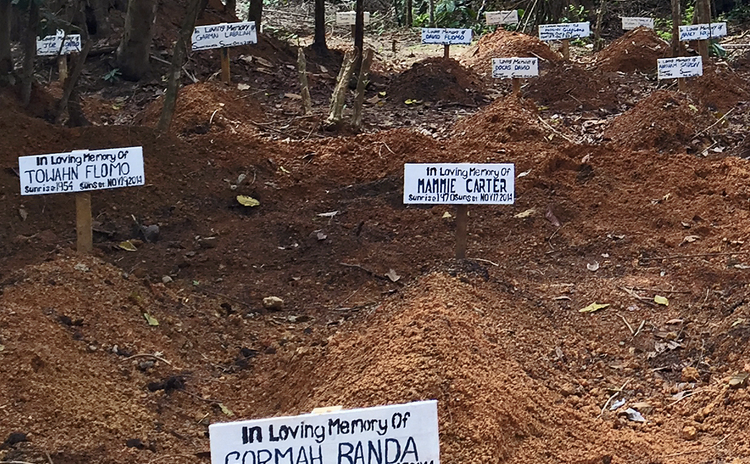
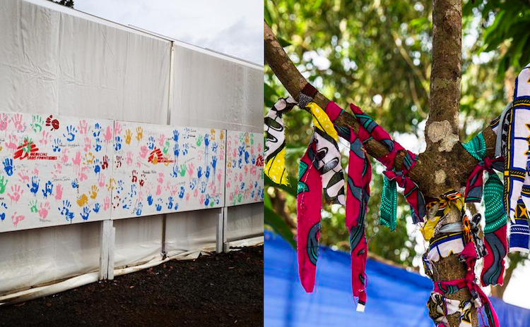

[The EbolaMapper project](thub.com/JohnTigue/EbolaMapper) is all about coming up with computer graphics (charts, interactives, maps, etc.) for visualizing infectious disease outbreaks. 

A sign of excellent news for any given outbreak is when the bullseye plot animations go static. For example, consider [the WHO's visualization](https://who-ocr.github.io/ebola-data/) shown below which is plotting data for the 2014 Ebola Outbreak in West Africa.

<image src='who-ebola-data.png' class='center' width='750' height='464' />

Each bullseye shows two datum: the outer circle is cumulative deaths and the inner circle is new deaths in the last 21 days. [21 days is the accepted incubation period](http://www.virology.ws/2014/10/16/the-quarantine-period-for-ebola-virus/) and that is why [Hans Rosling tracks new cases for the last 21 days](https://twitter.com/HansRosling/status/532346099462598656). When the inner circles shrink to zero the outbreak is over. 

Yet there are much lower tech ways of presenting information to people that can be quite affecting. On the grim side there are [the graves](http://www.npr.org/blogs/goatsandsoda/2014/12/02/367838698/one-villages-story-how-ebola-began-and-how-it-ends).

Sadder still are memorials such as [The Lancet's obituary for health care workers who died of ebola](http://www.thelancet.com/journals/lancet/article/PIIS0140-6736(14)62417-X/fulltext)  while caring for others -- true fallen heroes.

On the other hand there are signs of positive progress.

The image on the left is from [a MSF tweet](https://twitter.com/MSF/status/535149025922940930/photo/1):
<blockquote>The best part about battling #Ebola is seeing our patients recover. Here, hand prints are left in Monrovia #Liberia</blockquote> 

The image on the right is from [an UNMEER tweet](https://twitter.com/UNMEER/status/545802992956346369/photo/1):
<blockquote>Survivor Tree in Maforki, #SierraLeone holds piece of cloth for each patient who left ETU Ebola-free. #EbolaResponse</blockquote>

Those must be quite uplifting reminders on the front lines of the ebola response. Likewise EbolaMapper should have positive messages, say turning bulls-eyes green when there are no new cases. That will need to be kept in mind.