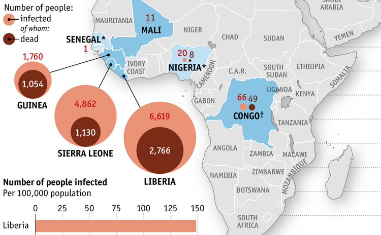

A major goal of this EbolaMapper project is to create the very best visualizations of ebola on the Web. Which leads to the question: what is the high bar? [**Update**: Spoiler, the answer is <a href='http://tigue.com/by-time/2014/11/13/nytimes-the-pace-car/'>The New York Times' visualization</a>.]

To answer that question I will be curating a collection of links to the best visualizations found on the Web.

For example, The Economist is doing good work:

&nbsp;

The curated links can be found on <a href="https://github.com/JohnTigue/EbolaMapper/wiki/Gallery-of-Ebola-Visualizations-Found-Across-the-Web">the EbolaMapper wiki</a>.

Note: EbolaMapper is the working title for this project; really it is more like "Reusable Outbreak Monitoring Web Components for a Global Outbreak Monitoring Network Organization." Right, so EbolaMapper is the working title until a better name comes along, if one did not just pass by a moment ago...
