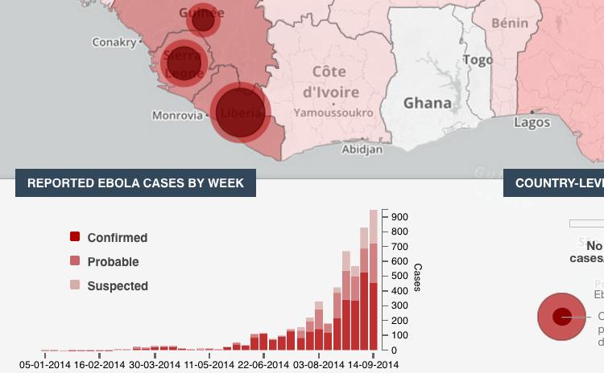

The thing that got me moving on this (ebola) outbreak project was <a href="https://extranet.who.int/ebola/">the WHO's Ebola Portal</a>, specifically the rather well implemented <a href="https://who-ocr.github.io/ebola-data/">Web visualization of the 2014 ebola outbreak</a>. 

 
That sort of thing is exactly what the world needs. As for technical implementation details, they made the right choice basing it on interactive JavaScript libraries rather than Flash. They planned to make the data available:
<blockquote>"Data will be made available for open access in the coming days. All data will be made available via open format downloads as well as through an open access API."</blockquote>

Sadly the visualization's development and, more importantly, its data seems to have stalled. The data was last updated on September 14, 2014 (almost three months old as I type this). <a href="https://github.com/who-ocr/ebola-data">The code is on github</a> with <a href="https://github.com/who-ocr/ebola-data/commit/e15404902e1ffb159bcd79d13508ebcff84a46e2">the last commit on September 27th</a>.

[**Update**: By mid-December 2014 the main site, <a href='https://extranet.who.int/ebola/'>extranet.who.int/ebola/</a>, had been taken down; I guess they did not realize that [the visualization lives on at GitHub](https://who-ocr.github.io/ebola-data/).]

I cannot find anything more about the planned open access APIs. Unfortunately I could not find any licensing information in the repository. I want to move their vision forward but using open source and open data. Or let us think big: why do we even need to wait around for the WHO to come down from on high with the numbers? Surely there is a better way...

These guys obviously did good work. I will try to get in contact with them. I will report back in an future post.

Nonetheless, this thing ("ebola-data" is its name on github) is what inspired me. If only it were clearly licensed and the data was fresh (and licensed openly). If such a thing were widget-ized and made freely available the Web would have a many more eyeballs taking in quality visualizations of the crisis. 

I am calling such a thing EbolaMapper. (The name is a bit misleading; the code is reusable in that there is nothing ebola specific about it but "Outbreak Visualization Widgets" is not a catchy at this time, even though that is what this is all about. I will get around to explaining all that in the long run.)

So, I started digging around and found out about <a href="http://eboladata.org/">the Ebola Open Data Jam</a> that took place on October 18th. Well, that there is the open data problem getting worked on.

Next I found <a href="http://www.meetup.com/Africa-Open-Data/events/210071892/">the Africa Open Data meetup</a>. On the conference call of November 7th it became clear that data validation was the current step, blocking quality visualizations. What better way to validate the data than to run it through a visualization on a world map?

So, I've started <a href="https://github.com/JohnTigue/EbolaMapper">a repository on github for EbolaMapper</a> which will be a clean room re-implementation of the WHO's ebola-data viz with a clear open source license (<a href="https://github.com/JohnTigue/EbolaMapper/blob/master/LICENSE">Apache 2.0</a>). I will use some data found by the Ebola Open Data Jam. What is really needed is a standard for data interchange -- APIs and such.

When EbolaMapper can do what the WHO ebola-data visualization does, and more, via data from a standard API, that will be the first major milestone in this project.