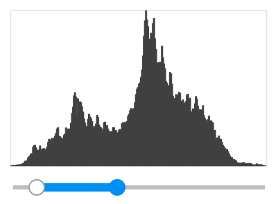
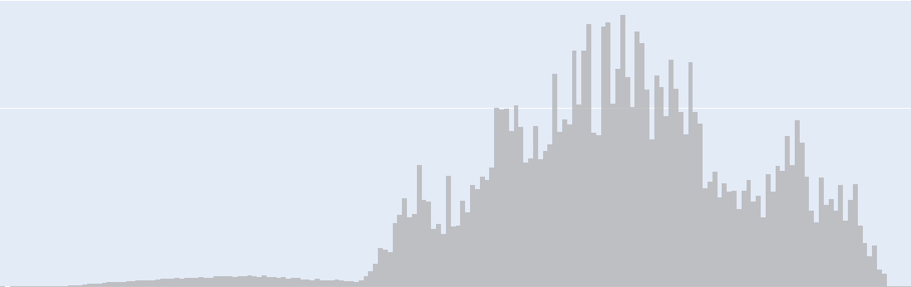

Over the last few weeks I have written so many variants on "eight bit
gauges" in Jupyter that I thought I might as well corral them all
together in a menagerie. By eight big gauges I mean histograms with
256 bins.

For example, the above image is for grayscale images as
implied by the gray gradient on the face of the histogram. The red
line is the same data but as a cumulative distribution, starting at
zero and marching monotonically to 100% total luminance.

The code is all Python using common plotting libraries (Bokeh, Plotly,
Matplotlib, etc.). In particular, the code has been well tested on
Colab, including working out full-screenable versions which perform well
as "slides." I've licensed the code under the Apache 2 license. So, peruse
the menagerie and maybe take one home.

There is a pre-run and runnable copy on Colab, 
[eight\_bit\_gauges.ipynb](https://colab.research.google.com/drive/1bMv3ya7rJzSi8tdmGAuT-Xm4TToBfxmB?usp=sharing),
which can also be found on GitHub in [the shell repo](https://github.com/reconstrue/shell/blob/master/ui/eight_bit_gauges.ipynb). To 
load it from from GitHub and run your own copy:  

