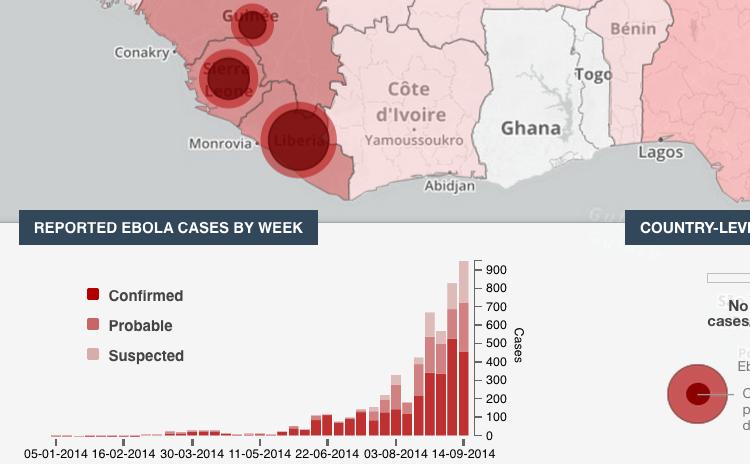
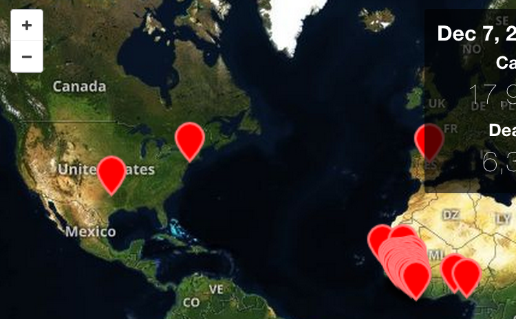
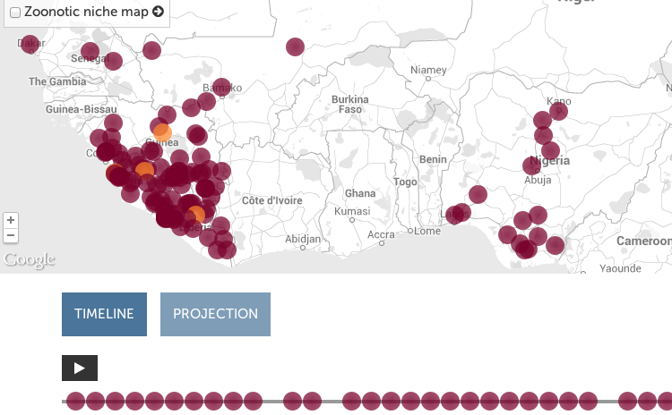

Visualizations on the Web can be classified as interactive or static. The split is not quite binary; is a zoomable map really "interactive"?

I want to produce both interactive and static viz, with hopefully the former being used to generate the latter. SVG is good for exporting static raster images to file or paper. D3.js uses SVG, so interactive D3.js-based visualizations should be able to export excellent static maps and charts (we will see). Some users of this information will be on limited machines so bandwidth-light static info should be readily available.

I have found very few highly interactive ebola visualizations. Please point out any that I have missed in the comments. The best three found so far are listed here.
 

<a href="https://who-ocr.github.io/ebola-data/">The WHO's ebola-data</a>

&nbsp;

<a href="http://www.pbs.org/wgbh/pages/frontline/health-science-technology/ebola-outbreak/map-how-the-ebola-outbreak-spread-through-africa/">PBS Frontline's map: how the ebola outbreak spread through Africa</a>

&nbsp;

<a href="http://healthmap.org/ebola/#timeline">HealthMap's Ebola timeline</a>

&nbsp;

All three's features, pros, and cons are analyzed on <a href="https://github.com/JohnTigue/EbolaMapper/wiki/Gallery-of-Ebola-Visualizations-Found-Across-the-Web">the EbolaMapper wiki</a>.