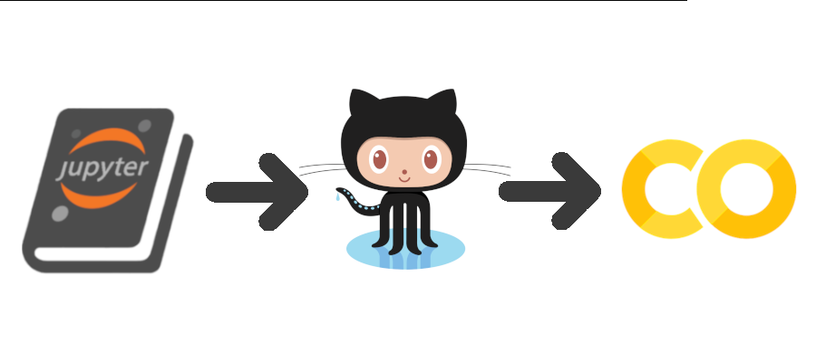

J-bopp is a no-money technique to get Jupyter Books published and running on other people's:
- Processor
- Publishing system
- Persistance

Specifically, the others are Google's Colab and Microsoft's GitHub:
- Processors: Colab
- Publishing system: GitHub Actions to build a Jupyter Book
- Persistance: GitHub's storage for the source repo and the SSG public web site via GitHub Pages

