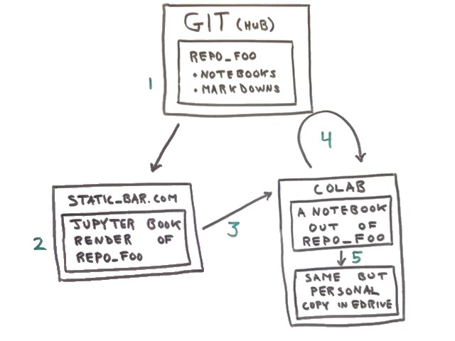

This is an addendum to my 2020-01 post entitled, 
[Jupyter Book to Colab](http://tigue.com/jupyter_book_to_colab/), wherein
I described how I hacked [Jupyter Book](https://jupyterbook.org/features/interact.html)
to interact with Colab rather than one of its already built-out
Jupyer services, say, [Binder](https://mybinder.org/)

I have found the this diagram helps explain what is going on under the
hood. In the context of Colab, A Jupyter Book based deploys,  can involve
four manifestions of any one Jupyter notebook. Without a diagram it can
be confusing.

Let's walk through the five green step.

## 1. The source notebook at home

A git repository is archived somewhere, say, Microsoft GitHub (but it
could be any git repo). In the context of this post the repo is one
built out to work with Jupyter Book, which means is it essentially
just a collection of Jupyter notebooks and markdown files.

## 2. Pre-run notebook as HTML

For step 2, the repo has been fetched from GitHub and run through
Jupyter Book with the output being a bunch of static web content
(HTML, JavaScript, CSS, and images).

Static web sites are the simplest kind of web site: they are simply
file servers talking HTTP. In this diagram the example static site is
http://static-foo.com.

## 3. Hand off to Colab

This is what in Jupyter Book is referred to as interacting, moving
from a static web page rendering of an (optionally pre-run) notebook
to something backed by a live Jupyter kernel. Normally, Jupyter Book
will hand off to Binder for provisioning Jupyter kernels. In my hack,
open source Binder is replaced with commercial 
[Google Colab](https://colab.research.google.com/)

The hand off is simply follow a link to Colab, which ends with a
map to the `.ipynb` file that Colab should load from GitHub. That mapping
will result in an URL of the form:

```
https://colab.research.google.com/github/my_org/my_repo/blob/my_branch/my_file.ipynb
```

## 4. Colab kernel spin-up

So, the web browser follow the `http://colab.research.google.com` URL,
loading a new web page. At Colab, an HTTP GET arrives and the URL is
parsed. When colab sees the `/github/` part, it knows that the user is
requesting that an `.ipynb` file be fetched from GitHub. The tail of
the URL provides the organization, repo name, and relative file
path. Colab then fetches the specified file from `github.com`.

Behind the scene Colab spins up a new virtual machine to provide a
Jupyter kernel for the request.

Eventually (quickly) the HTTP response goes down to the browser where
the user sees the notebook and can run the code. 

## 5. Going into playground mode

"Playground mode" is the Colab term for "make a copy of that file and
let me modify it." Without this final (optional step) the user cannot
edit the code. This also sets the user up to have a place to save
the modified `.ipynb` in Googl Drive.


The take away is that open source tools make it possible to have a
static web site showing HTML rendering of `.ipynb` files, and more
significantly it is possilby to link to free Jupyter kernel on
Colab. A static web site linking to free compute. Tasty.
