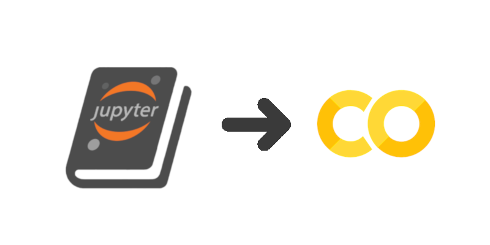

Like any developer with a blog, I occasionally talk about blog
tooling. Sorry. I just went through ye olde blog overhaul for the
first time in years, so the sensitive should stop reading now. 

## The novelty

I'm only going to go over the truly novel bit, which as the title
implies is the integration of Jupyter Book and Colab. 

The contextual goal is a static site for a software developer. The
site's front consists of a blog and set of projects. The latter
involves a lot of Jupyter notebooks, which are static hostly on the
static site as HTML snapshots of pre-run notebooks. Additionally,
reader can easily execute the notebooks, without any admin hassles nor
costs for me, by clicking through to Google Colab.

The "clicking through to Google Colab" hack is the novel bit. Jupyter
Book usually clicks through to JupyterHub, not Colab. (Of course, it
would be really helpful and interesting if those notebooks being
clicked through to were previously tested to run on Colab, but that is
out of the scope of this post.)

## Context

I've been a long time believer in static site generators (SSGs). For
this blog rebuild, I'm using two SSG tools: Gatsby and Jupyter Book. I
use Gastby to SSG the blog, and I use Jupyter Book to SSG repos of
notebook which act as the demo/web presence for the code projects. The
SSG notebooks have links into Google Colab if folks want to actually
run a given notebook on a VM, rather than just read a static notebook
rendering.

Gatsby was the obvious choice since I've been using React and GraphQL
for a while now. And Jupyter Book is simply the best in class for its
task (notebook SSGing). I can report that SSG tooling has come along
nicely over the last few years.

Jupyter Book generates the "static site" for a given git repo full of
notebooks (*.ipynb files). The static site will have pre-run notebook
web pages i.e. cell outputs will be included to demonstrate what the
software can do.

Additionally if the reader wishes they can interact with the notebook:
a link in the Jupyter Book generated notebook pages will have a link
to Colab which will grab the notebook clean from GitHub and provision
a virtual machine within which to run and interact with the notebook.

Combined these two SSG tools enable a projects-and-blog web presence
for a developer to be run completely staticly, without involving say
Medium for blog hosting and MSFT GitHub for notebook rendering, yet
code can also be run "dynamically" on Colab. It makes for a low hassle
yet high functionality coder's blog.

## Interactivity for Jupyter Book

I want readers to be able to expeditiously run and interact with
the code in said notebooks statically hosted on tigue.com. And I don't
want to manage that nor pay for the provioning of VMs, thank you very
much. Google Colab fits the bill perfectly.

Jupyter Book has a lot of nice functionality already. I don't know of
a better equivalent. Nonetheless, for my React-based blog there is
functionality overlap between Gatsby and Jupyter Book. E.g., the
latter uses Jekyll for static page generation, which the former is
also doing.

Conceivably, much of Jupyter Book could be reproduced by
Gatsby. But Gatsby is JavaScript; that's getting away from the Python
world so it's unlikely in the short term. So for now: blog is Gastby
based and repo-of-notebooks is Jupyter Book based.

## Linking Jupyter Book and Colab

So, with the context set, the solution boils down to a small hack of
the HTML templates in Jupyter Book. It's not even really a hack, just
an unexpected novel use, which good technologies enable.

Jupyter Book already has a customization hook for providing a button
uses can click to be taken to some site where JupyterHub (or Docker)
is running. The code where the hook is used in in the 
[jupyterhub.html](https://github.com/jupyter/jupyter-book/blob/master/jupyter_book/book_template/_includes/buttons/jupyterhub.html#L9)
template. It's a bit gruesome but the point is all the info needed
to build the equivalent URL for Colab is there: site, repo, branch, etc.:

```html

    

    


hub/user-redirect/git-pull?repo={{ site.binder_repo_base }}/{{ site.binder_repo_org }}/{{ site.binder_repo_name }}&amp;branch={{ site.binder_repo_branch }}&amp;subPath={{ page.interact_link | url_encode }}&amp;app={{ hub_app }}
{{ site.images_url | relative_url }}/logo_jupyterhub.svg
<a href="{{ site.jupyterhub_url }}/{{ interact_url_jupyterhub }}"><button class="interact-button" id="interact-button-jupyterhub">{{ site.jupyterhub_interact_text }}</button></a>
```

So, the "hack" is simply a modification of one of the HTML templates that are in the content repo.
