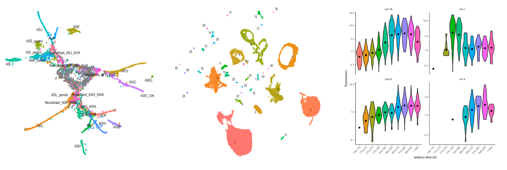

[Monocle 3](https://cole-trapnell-lab.github.io/monocle3/) is "an analysis toolkit for single-cell RNA-seq." It is [MIT](https://github.com/cole-trapnell-lab/monocle3/blob/master/LICENSE.md) code out of Seattle's Seattle Lake Union area. The source code is all R.

I hacked on Colab to see if I could get it to run Monocle3. The experiment went pretty well.

<a href="https://colab.research.google.com/drive/1Pj62n18qRb9DxPKM6L-PRdxV0-LYWk-P#scrollTo=DVxk3ON3J7Gy" >

Migth as well use the above OpenInColab button to check it out but
the code can also be found on GitHub in the repo, [@reconstrue/single_cell_on_colab](https://github.com/reconstrue/single_cell_on_colab/tree/master/tools/monocle)

