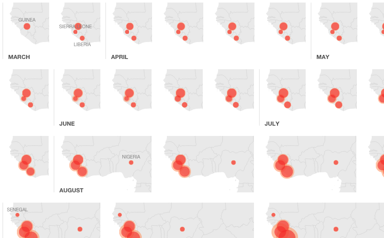

National Geographic sure knows the power of good visuals. Their <a href="http://news.nationalgeographic.com/news/2014/09/140925-mapping-the-spread-of-ebola/">ebola tracking report</a> has one particularly neat yet unusual view: a graphical calendar of 2014, one map per week.

