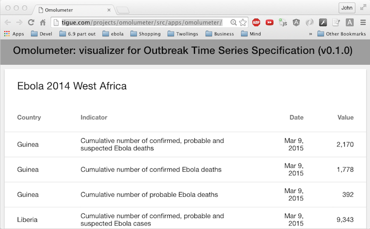

This post defines the word "omolumeter" and introduces sofware, called Omolumeter, which is a web-app for visualizing epidemics, historical or simulated.

My main side project over the last many months is in response to what I saw during the last big Ebola outbreak which – sadly – is still [simmering along](http://www.nytimes.com/2016/03/30/health/emergency-over-ebola-has-ended-who-says.html?_r=1) such that "flare-ups of cases continue" despite the emergency having been officially declared over.
The first piece of software to come out of that side project is called an omolumeter ([live demo of v0.1.0](http://tigue.com/projects/omolumeter/src/apps/omolumeter/)).

Earlier I completed [analysis of the open data on the Ebola 2014 West Africa outbreak](http://tigue.com/by-time/2014/12/28/ebola-open-data-analysis-completed/).
Currently, building on that analysis, I am working on a data format I am calling the [Outbreak Time Series Specification](https://github.com/JohnTigue/outbreak_time_series/wiki/Outbreak-Time-Series-Specification-Overview) ("the Spec").
The API design is actually leveraging the recently completed W3C Recommendation, [CSV on the Web](https://www.w3.org/2013/csvw/wiki/Main_Page) (CSVW).
In parallel I am writing software which reads files (or in HTTP terminology, resources) that are formatted compliant to the Spec.

The software is called an omolumeter, a word I just made up.
It's a meter for Omolu, the African orisha ("god") of epidemics who both brings and takes away diseases.
It will be the first app that reads outbreak data compliant to the Spec.
Currently all it does is parse a CSV that contains outbreak data and renders it in a table view.
Fancier visualizations such as charts and maps are to be added in later versions of the omolumeter.
Everything will be implemented using liberally licensed web technology, no flash or native apps just HTML and JavaScript (and CSS, and SVG, and...).
This will be the codebase that is the reference implementation for the Spec.
I am building this out as I write the spec in order to prove it is easy to implement software which works with the Spec.

The omolumeter code is just a single web page with a lot of JavaScript, known as a Single Page App (SPA).
Specifically it is based on the AngularJS framework (v1.5) with a Material Design look-and-feel user experience.
The same code can be packaged as a native app for iOS and Android (so same user experiences as a native app but it is not technically a native app; it is web technology packaged for a native deploy).
It currently works in Chrome Mobile and Safari Mobile.

Internet Explorer is not going to be supported. (Yeah, I said it.) Well, not by me.
If anyone wants to join the party, pull requests are welcome on [GitHub](https://github.com/JohnTigue/outbreak_time_series).
