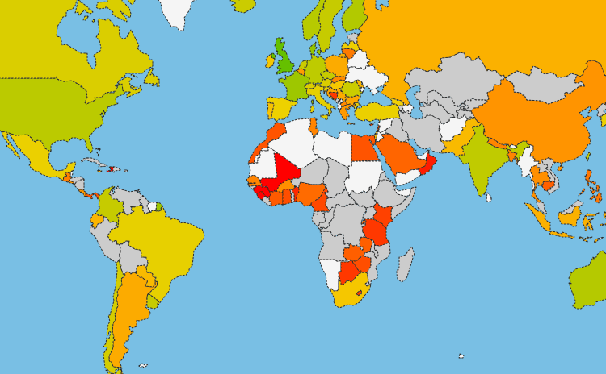

As part of the EbolaMapper project, I reported on the state of the ebola open data landscape to the Africa Open Data Group.
[That report](https://github.com/JohnTigue/EbolaMapper/wiki/AODG-Report-1-from-John-Tigue) is currently the best overview of the EbolaMapper project, including its goals and deliverables
i.e. open source tools for visualizing epidemiological outbreaks via [the Outbreak Time Series Specification data APIs](https://github.com/JohnTigue/EbolaMapper/wiki/Outbreak-Time-Series-Specification-Overview).

The project name, EbolaMapper, has become misleading as there is nothing ebola specific about the project (although ebola data is used for testing).
That name was chosen during the ebola outbreak in West Africa before the project's scope expanded beyond just a specific ebola crisis.
So, a better name is needed to go with the description "reusable tools and data standard for tracking infectious disease outbreaks, with the intent of helping to modernize the global outbreak monitoring infrastructure, especially by decentralizing the network."

(When the project started, there was a serious dearth of open data on the crisis.
The project eventually outgrew the immediate need of curating data on the outbreak.
[Eventually](https://github.com/JohnTigue/EbolaMapper/wiki/AODG-Report-1-from-John-Tigue#survey-of-the-webs-ebola-2014-outbreak-data-and-visualizations) the UN started publishing ebola statistics, 
and independently [Caitlin Rivers' efforts](https://github.com/cmrivers/ebola/) seeded the open data collection effort.)

If the report is [tl;dr](https://en.wikipedia.org/wiki/Wikipedia:Too_long;_didn%27t_read) then perhaps just check out [the interactive Ebola visualizations](https://github.com/JohnTigue/EbolaMapper/wiki/Gallery-of-Ebola-Visualizations-Found-Across-the-Web).
