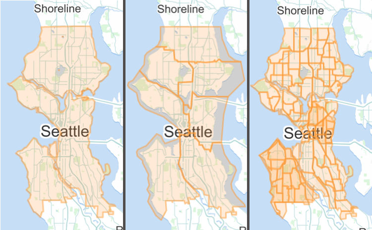

This year some of my projects needed maps of Seattle, in particular while working with [Open Seattle](http://openseattle.org/) and [the City of Seattle](http://www.seattle.gov/). 
Specifically I have needed [City Council District](http://www.seattle.gov/cityclerk/municipal-code-and-city-charter/council-districts) and census-related maps. 
The [census geographic hierarchy](https://www.census.gov/geo/reference/) has three levels for Seattle: 
Census Blocks are the smallest areas which are then aggregated into Census Block Groups which in turn are combined into Census Tracks.
Of course, there are other administrative geographic units into which Seattle has be subdivided: neighborhoods, zips code areas, school districts, etc.

The City of Seattle actually does a good job of making this information available as shapefiles on its [open data site](https://data.seattle.gov/). 
Nonetheless, what web developers want is to have the data extremely readily available in a source code repository (for modern open source, read: a git repo) and in formats that are immediately usable in web apps, specifically GeoJSON and TopoJSON. 

So, in Open Seattle we have been building out such a repository of JSON files and hosting it on GitHub.
That repository is called [seattle-boundaries](https://github.com/openseattle/seattle-boundaries).

As a further convenience, [Seth Vincent](http://sethvincent.com/) has packaged up the data for distribution via [npm](https://www.npmjs.com/package/seattle-boundaries).
Additionally, he has also taken the maps and made available an API service, [boundaries.seattle.io](http://boundaries.seattle.io/).
This service will reverse-geocode a point into a list containing one entry for each map in the repo, where the list items are the GeoJSON feature to which the point belongs.
For example, let us say you already know where in town the best place for dim sum is (read: you have a point) and you are curious as to which regions it belongs.
The URL to fetch from is:  
[http://boundaries.seattle.io/boundaries?long=-122.323334&lat=47.598109](http://boundaries.seattle.io/boundaries?long=-122.323334&lat=47.598109)

