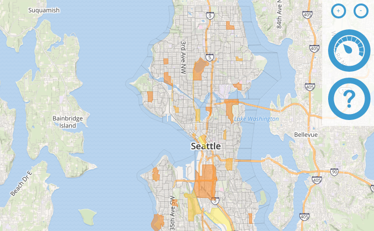

Back in April 2015, I started working with the City of Seattle on a very interesting project which just went live at version 1.0 ([press release](https://www.newamerica.org/oti/seattle-launches-broadband-speed-test-in-partnership-with-oti/)).
Note: here "1.0" means it has been publicly deployed and is collecting data but 2.0 will be slicker still.
I am really excited about this technology and more importantly the long term legal implications.

I was the project lead on this.
[Open Technology Institute](https://www.newamerica.org/oti) was the "vendor."
Bruce Blood, Open Data Manager for the City, was the point man inside the government.
Bruce is a good guy and he is doing great work; it will be a civic loss when he retires later this year.

The City is calling the tool the ["Broadband Speed Test"](http://www.seattle.gov/broadband-speed-test).
Personally I label it as an "ISP quality monitor."
("Broadband" sounds so highfalutin that the term must have come out of some marketing department.)
We already have air quality monitors and the County mails out pamphlets regularly which enumerate quality measures for the drinking water.
The goal is of this project is that one day we will have laws regulating net neutrality and quality.
In such a regulatory scheme we will need ISP quality monitoring tools.

Clearly we do not currently have laws for this but even it the government simply collects and disseminates network quality information that is a big win.
And now for the first time in the USA we have the government (albeit only a municipal government) collecting this sort of information.
Hopefully efforts like this will lead to federal legislation.

Even without regulatory laws, simply governmental monitoring of the network may well lead to the situation improving.
An analogy can be made to commercial airlines.
The federal Department of Transportation collects performance data on airlines.
For example, "Gate Departure Time" data is collected.
Then [reports of delays per airline](https://www.rita.dot.gov/bts/sites/rita.dot.gov.bts/files/press_releases/airline_ontime_statistics.html) are periodically published.

Simply collecting and making available such data was sufficient to get the airline corporations to improve those numbers.
(Ironically, this is one of the reasons that we Americans now spend so much time parked on runways: the numbers reflect when an aircraft pushed off from its gate, not when the airplane started flying.)
Based on IP addresses collected during network speed testing, we can determine which ISP the test is being run over and then later generate quality reports per ISP.
Hopefully, similar to the airline departure times, we will see an improvement in the performance numbers of ISPs now that we are starting to collect the relevant information.

So, legally this may well prove to be interesting stuff in the long term. Moving on to the technological aspects of this project, that is currently interesting.
[NDT](http://www.measurementlab.net/tools/ndt/) (Network Diagnostic Test) is the very core of this technology package.
NDT is the bit-pushing speed tester.
The code is [liberally licensed](https://github.com/ndt-project/ndt/blob/master/COPYING).
This is the code which actually generates a fake file and sends it to the server for upload timing.
Then the server sends a fake file to the client for download timing.

The map UI is based on two high-quality JavaScript GIS libraries: [Leaflet](http://leafletjs.com/) for the base map and [Turf](http://turfjs.org/) for aggregating results within US Census Block Groups.

[Piecewise](https://github.com/opentechinstitute/piecewise) is the name of the web app that runs the tests and generates the reports and provides the user interface.
Unfortunately [Piecewise is licensed under GPL3](https://github.com/opentechinstitute/piecewise/blob/master/LICENSE), rather than Apache or MIT, but that detail is not a show stopper.

If you want further information, I put a lot of work into [a wiki](https://github.com/openseattle/seattlespeeds/wiki) and you can also see some of [my project management artifacts.](http://tigue.com/seattlespeeds/)
