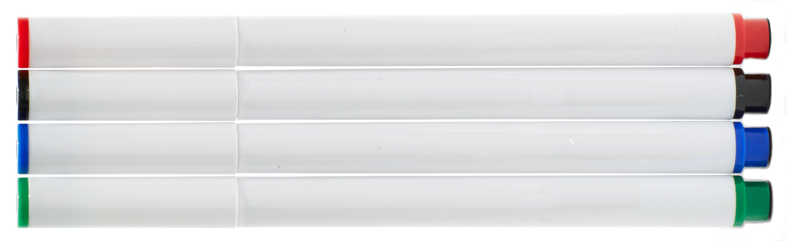

Of late I've been doing so much machine learning coding in an image
processing context that it has caused a completely separate, long
simmering potential project to force its way into reality. That
project is whiteboard capture post-processing. I'm calling it
Whiteboarder, with a tagline of "a two-bit image processor." Two bits
can encode four states, which in the case of whiteboard images can be
used to represent the four most common whiteboard pen colors: black,
red, green, and blue.

Note: this is very much not an end-user tool; the tech is simply not
mature enough for full auto-pilot but the results can be impressive
with a bit of human in the mix. Rather, this is for folks who are
comfortable seeing what is going on under the hood. There will be
code.

Additionally, the project has also been an experiment to probe how far
a Jupyter UI be driven towards an end user app with presentable
UI. 

To take it for a test drive, click below:

