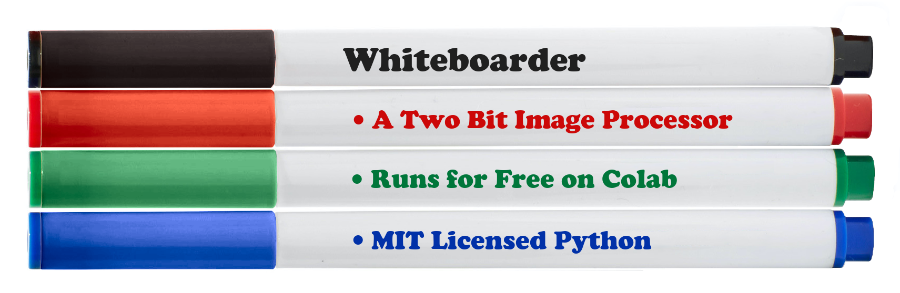
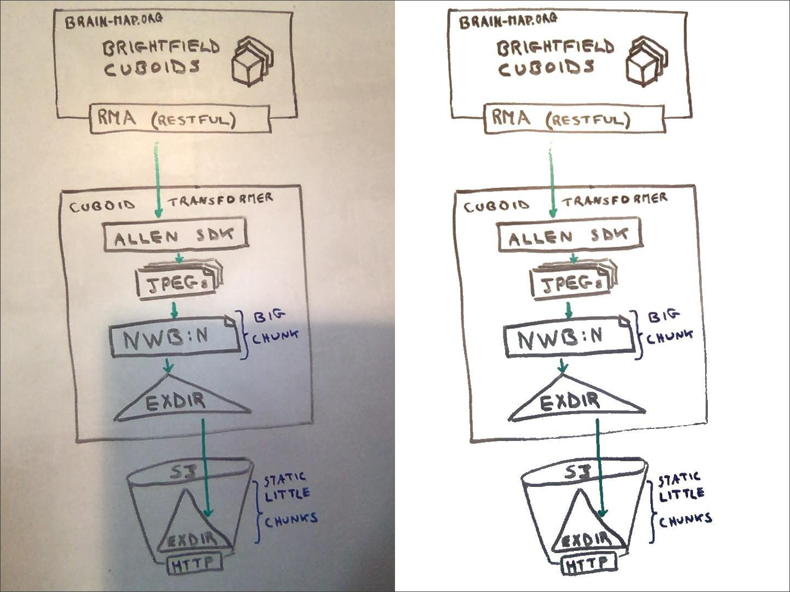
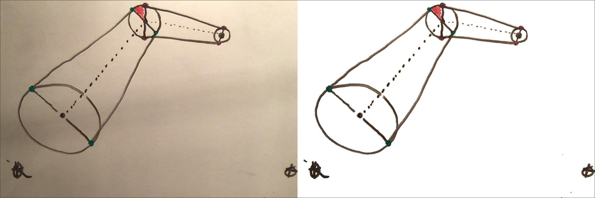
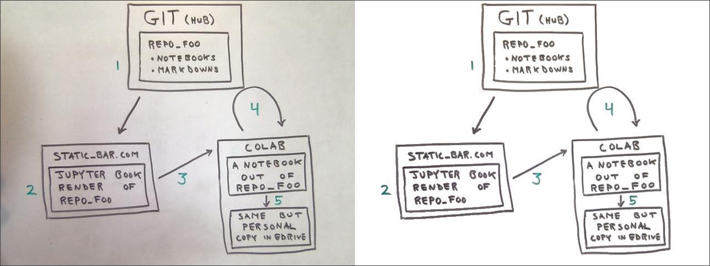

	&nbsp; 

Whiteboarder is a two bit image processor, tuned for whiteboard
captures. The four most common dry erase marker colors are recognized:
black, red, green, and blue. Four colors, ergo two bit color images.

 
&nbsp; 

I have long wanted a tool dedicated to cleaning up whiteboard capture
images. There are commercial tools but nothing made me happy. Of late
I've been coding a lot of image processing in a machine learning
context. So, Whiteboarder just kinda happened over this last month by
hacking on a Jupyter notebook to see what could be cooked up with the
tools I was already using for a different purpose.

&nbsp; 

Note: this is very much not an end-user tool. The tech is simply not
mature enough for full auto-pilot. But the results can be impressive
with a touch of human intelligence in the mix. So, Whiteboarder is for
folks who are comfortable seeing what is going on under the
hood. There will be code.

&nbsp; 

Additionally, the project is an experiment with Jupyter as a
development platform. The question is: just how far can a Jupyter
notebook's UI be morphed into an end-user-ish utility tool? The code is 
<a href="https://github.com/JohnTigue/whiteboarder">available on GitHub.</a>

Whiteboard can read your own images: specify an URL, upload a file, or
take a picture in-browser. To take Whiteboarder for a test drive on
Colab click below:

